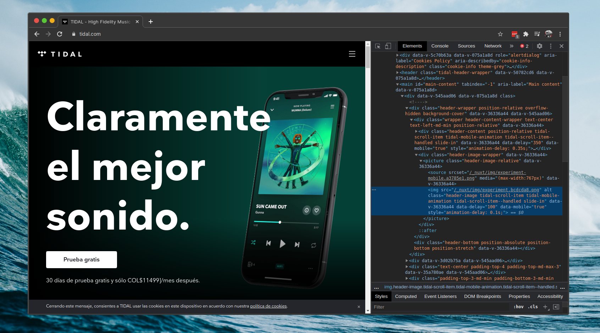

<h1 align="center">🕸 Tidal Web Scraper 🎹</h1>

<small>Web scraper to export to CSV or JSON yout tidal playlist </small>

## How use the scrapper?
### Requirements
- Python*
- Pip*
- Selenium*
- Google Chrome v86
- Google Chrome Driver*
- Linux

If you have another version of google chrome or a different operating system you can change the driver by downloading it at [Google Chrome Drivers Download Center.](https://sites.google.com/a/chromium.org/chromedriver/downloads)